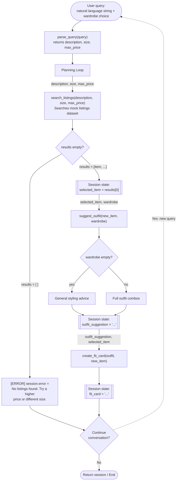

# FitFindr — planning.md

> Complete this document before writing any implementation code.
> Your spec and agent diagram are what you'll use to direct AI tools (Claude, Copilot, etc.) to generate your implementation — the more specific they are, the more useful the generated code will be.
> Your planning.md will be reviewed as part of your submission.
> Update it before starting any stretch features.

---

## Tools

List every tool your agent will use. For each tool, fill in all four fields.
You must have at least 3 tools. The three required tools are listed — add any additional tools below them.

### Tool 1: search_listings

**What it does:**
<!-- Describe what this tool does in 1–2 sentences -->
Searches the listings dataset and returns up to 8 matching items, filtered by description, size, and max_price.

**Input parameters:**
<!-- List each parameter, its type, and what it represents -->
- `description` (str): A natural language description of the item, matched against listing fields (title, description, style_tags, etc.). Already stripped of size/price by parse_query.
- `size` (str): The user's clothing size. May be none to skip size filter.
- `max_price` (float): Maximum price user is looking for. May be none to skip price filter.

**What it returns:**
<!-- Describe the return value — what fields does a result contain? -->
Results is an array of size 8 which contains listings. Each listing is a dictionary describing an item (listing) with its id, title, description, size, condition, etc. These are pulled from the listings.json dataset if they are matching the user provided parameters. 

**What happens if it fails or returns nothing:**
<!-- What should the agent do if no listings match? -->
Tell user we were not able to find good listing matches. Ask user to try a new prompt if they would like to continue.

---

### Tool 2: suggest_outfit

**What it does:**
<!-- Describe what this tool does in 1–2 sentences -->
Takes a new item and the user's wardrobe and suggests one or more outfit combinations.

**Input parameters:**
<!-- List each parameter, its type, and what it represents -->
- `new_item` (dict): dict which describes the item; keys are different features of the item. What we will be suggesting an outfit against.
- `wardrobe` (dict): the users current wardrobe (full of items with descriptions)

**What it returns:**
<!-- Describe the return value -->
- `outfit_suggestion` (dict): Returns an outfit dict containing new_item plus complementary items, a description, and style tags. Also contains field: general_advice. If no outfit can be generated: all fields are None, except general_advice. If outfit can be generated, general_advice is None.

**What happens if it fails or returns nothing:**
<!-- What should the agent do if the wardrobe is empty or no outfit can be suggested? -->
If the wardrobe is empty, that is treated as a normal case: the tool returns general styling advice based on the LLM's fashion knowledge rather than combinations from owned items, and the flow continues to create_fit_card. If the tool actually fails or returns nothing usable (e.g. the LLM call errors), the agent reports that it couldn't generate an outfit suggestion and asks the user whether they'd like to search for something different.

---

### Tool 3: create_fit_card

**What it does:**
<!-- Describe what this tool does in 1–2 sentences -->
Gives a short description of a full outfit that is shareable. Must be different 
each time for different inputs. 

**Input parameters:**
<!-- List each parameter, its type, and what it represents -->
- `outfit` (dict): Outfit is a dict that contains items, new_item, and a description and style tags. Also, has field general_advice, that is None, unless outfit could not be generated. Represents the outfit we will suggest to user.
- `new_item` (dict): New item we got from search_listings

**What it returns:**
<!-- Describe the return value -->
Returns a short caption for the item. Tells where they found it. Sometimes mentions the price. Sounds excited. Is descriptive of the style of the outfit. Sounds conversational and human.

**What happens if it fails or returns nothing:**
<!-- What should the agent do if the outfit data is incomplete? -->
If create fit card fails, give the user the listing and the suggested outfit details. And tell them we were unable to create a fit card. Ask if they would like to try again. 

---

### Additional Tools (if any)

<!-- Copy the block above for any tools beyond the required three -->
### Tool 4: parse_query

**What it does:**
Parses a natural language user query string into structured parameters 
for search_listings. Extracts size and max_price if present, and returns 
the remaining text as the description.

**Input parameters:**
- `query` (str): The raw natural language query from the user. 
  e.g. "vintage graphic tee under $30, size M"

**What it returns:**
Returns a dict with three fields:
- `description` (str): The query with size and price references removed.
  e.g. "vintage graphic tee"
- `size` (str or None): Extracted size if present, e.g. "M". None if not found.
- `max_price` (float or None): Extracted price if present, e.g. 30.0. None if not found.

**What happens if it fails or returns nothing:**
If parsing fails or no fields can be extracted, description defaults to 
the full raw query string, size defaults to None, and max_price defaults 
to None. The agent never stops on a parse failure — it always produces 
something search_listings can use.

---

## Planning Loop

**How does your agent decide which tool to call next?**
<!-- Describe the logic your planning loop uses. What does it look at? What conditions change its behavior? How does it know when it's done? -->
The raw query is first passed to parse_query, which extracts description, size, and max_price. These are then passed to search_listings.

If `results` is empty, the agent returns an error message prompting the 
user to try a different description, size, or price. The run ends here — 
`suggest_outfit` and `create_fit_card` are not called.

If `results` is non-empty, `results[0]` is stored as `session["selected_item"]` 
and passed alongside `session["wardrobe"]` into `suggest_outfit`. If the 
wardrobe is empty, general styling advice is returned rather than 
combinations from owned items. The result is stored as `session["outfit_suggestion"]`.

`create_fit_card` is then called with `session["outfit_suggestion"]` and 
`session["selected_item"]`. The result is stored as `session["fit_card"]`.

The agent is done when either the error path returns early or all three 
tools have completed and `session["fit_card"]` is populated.

---

## State Management

**How does information from one tool get passed to the next?**
<!-- Describe how your agent stores and accesses state within a session. What data is tracked? How is it passed between tool calls? -->

---

## Error Handling

For each tool, describe the specific failure mode you're handling and what the agent does in response.

| Tool | Failure mode | Agent response |
|------|-------------|----------------|
| search_listings | No results match the query | Tell the user no listings were found and prompt them to try again with a new description |
| suggest_outfit | Wardrobe is empty | outfit_suggestion has a field called general_advice which is filled with fashion suggestion from the LLM and all other fields are made None. We continue to the fit_card but with the fashion suggestion |
| create_fit_card | Outfit input is missing or incomplete | We generate a fitcard with the fashion suggestion filled in suggest_outfit if some outfit input is missing. If somehow everything is missing we tell the user something went wrong to try again. |

---

## Architecture
<!-- Draw a diagram of your agent showing how the components connect:
     User input → Planning Loop → Tools (search_listings, suggest_outfit, create_fit_card)
                                                                          ↕
                                                                   State / Session
     Show what triggers each tool, how state flows between them, and where error paths branch off.
     ASCII art, a Mermaid diagram (https://mermaid.js.org/syntax/flowchart.html), or an embedded
     sketch are all fine. You'll share this diagram with an AI tool when asking it to implement
     the planning loop and each individual tool. -->

---

## AI Tool Plan

<!-- For each part of the implementation below, describe:
     - Which AI tool you plan to use (Claude, Copilot, ChatGPT, etc.)
     - What you'll give it as input (which sections of this planning.md, your agent diagram)
     - What you expect it to produce
     - How you'll verify the output matches your spec before moving on

     "I'll use AI to help me code" is not a plan.
     "I'll give Claude my Tool 1 spec (inputs, return value, failure mode) and ask it to implement
     search_listings() using load_listings() from the data loader — then test it against 3 queries
     before trusting it" is a plan. -->

**Milestone 3 — Individual tool implementations:**
- Remember to use load_listings(), get_example_wardrobe(), and get_empty_warddrobe
0. `parse_query(query)`: Give Claude Tool 4 details from planning.md (input, return value, failure mode). Ask it to implement a function that takes the raw query string and returns a dict with `description`, `size`, and `max_price`. Tell it to extract size (e.g. "size M") and max_price (e.g. "under $30") from the string, with the remaining text as `description`, and to default any field it can't find to None (never crash on a parse failure). Before using it, I'll test it on query strings: one with both size and price, one with only price, one with only size, and one with neither. Confirming each returns the expected dict with correct defaults.
1. `search_listings(description, size, max_price)`: Give Claude Tool 1 details from planning.md (inputs, return value, failure mode) and ask it to implement the function using load_listings() from the data loader. Before running it, I'll check that the generated code filters by all three parameters and handles the empty-results case. Then I'll test it with 3 queries.
2. `suggest_outfit(new_item, wardrobe)`: Give Claude Tool 2 details from planning.md (inputs, return value, failure mode). Tell it that the loop is supposed to pass results[0] of search_listings() and the wardrobe loaded at startup into suggest outfit. suggest_outfit() does not call get_example_wardrobe(). The outfit generated by suggest_outfit is loaded into session. Run the flow between search listings and suggest outfit 3 times, check that the resulting outfit dict contains the new_item and appropriate selections, description, and style tags. Test empty wardrobe example to see that styling suggestions are made from LLM fashion knowledge.
3. `create_fit_card(outfit, new_item)`: Give Claude Tool 3 details from planning.md (inputs, return value, failure mode). In the planning loop, the outfit in session, and new_item from session are passed to create_fit_card. Run loop 3 times, check that description is relevant and human-like. 

**Milestone 4 — Planning loop and state management:**
0. run_agent() step 1: Tell Claude purpose is: Initialize the session with _new_session(). Tell it to use get_example_wardrobe to load wardrobe into session. session["wardrobe"] = get_example_wardrobe(). Confirm that code is loading these correctly. Test with dataset and check output. 

---

## Design
## A Complete Interaction (Step by Step)

Write out what a full user interaction looks like from start to finish — tool call by tool call. Use a specific example query.

**Example user query:** "I'm looking for a vintage graphic tee under $30. I am size M. I mostly wear baggy jeans and chunky sneakers. What's out there and how would I style it?"

**Step 1:**
<!-- What does the agent do first? Which tool is called? With what input? -->
The agent calls search_listing with the params. It loads up the listings from the dataset and filters by description, size, and price. 

**Step 2:**
<!-- What happens next? What was returned from step 1? What tool is called now? -->
Agent returns the top k listings by relevance. We select the top result. If results of search are empty: agent will tell the user to try a different description or change other requirements. Agent stops if results are empty.

We call suggest_outfit(new_item=selected_item, wardrobe=wardrobe) using the item stored in session and the wardrobe loaded at startup. 

Agent stores result as outfit_suggestion in session. 

If wardrobe is empty we offer general styling advice. 

If suggest_outfit fails or returns nothing we tell the user we couldn't generate a suggestion and then asks user if they would like to try to find a new outfit. This is not in the diagram (will be listed under error-handling). !! REVIEW !!

Store outfit suggestion. 
**Step 3:**
<!-- Continue until the full interaction is complete -->
Agent calls create_fit_card with outfit_suggestion and new_item which are stored in the session. Agent stores result as fit_card in the session and displays it to user: "thrifted this faded band tee off of depop for $22 and it looks amazing with levi's."

**Final output to user:**
<!-- What does the user actually see at the end? -->
User receives matched listing from step 1, outfit suggestion from step 2 and the shareable fit card from step 3. If search listing fails, user will be prompted to try again with different parameters. If wardrobe is empty, general styling advice will be offered. If suggest outfit fails, prompt the user to try searching for something different.